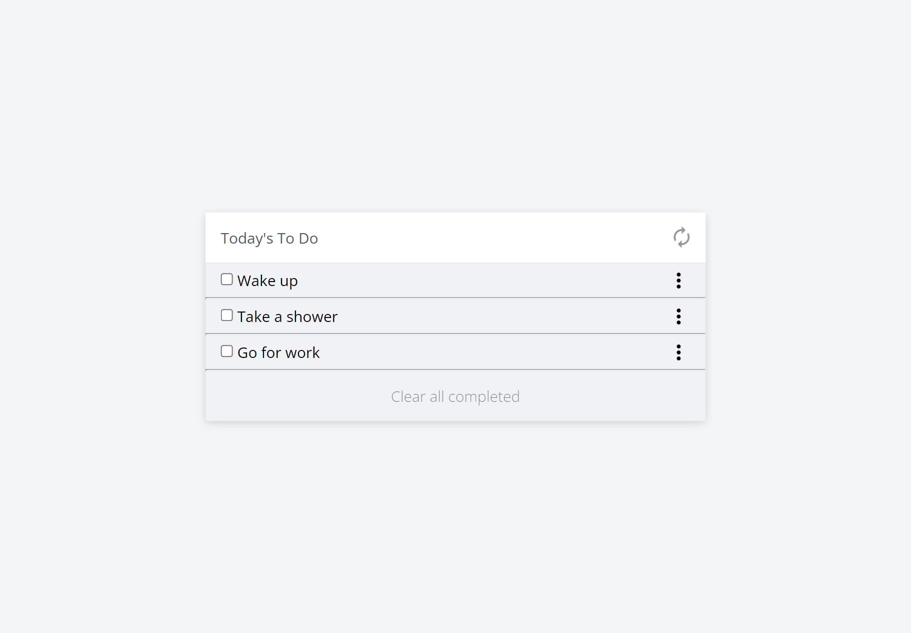

# To-do List


> Simple to-do list.



[Live Demo Link](https://munsa1.github.io/to-do-test/dist)

"To-do list" is a tool that helps to organize your day. It simply lists the things that you need to do and allows you to mark them as complete.

## Built With

- HTML
- CSS
- JavaScript

## Getting Started

To get a local copy up and running follow these simple example steps.

### Prerequisites

- NodeJS - [v16.x](https://nodejs.org/en/)

### Setup

```cmd
git clone https://github.com/munsa1/to-do-test.git
cd ./to-do-test
```

### Install

```cmd
npm install
```

### Usage

```cmd
npm start
```

## Authors

👤 **Munsa Mibenge**

- GitHub: [@munsa1](https://github.com/munsa1)
- LinkedIn: [LinkedIn](https://www.linkedin.com/in/munsa-mibenge-a35736205/)

## 🤝 Contributing

Contributions, issues, and feature requests are welcome!

Feel free to check the [issues page](../../issues/).

## Show your support

Give a ⭐️ if you like this project!

## Acknowledgments
Data Fair Blog (https://data-flair.training/blogs/javascript-project-to-do-list/)

## 📝 License

This project is [MIT](./MIT.md) licensed.